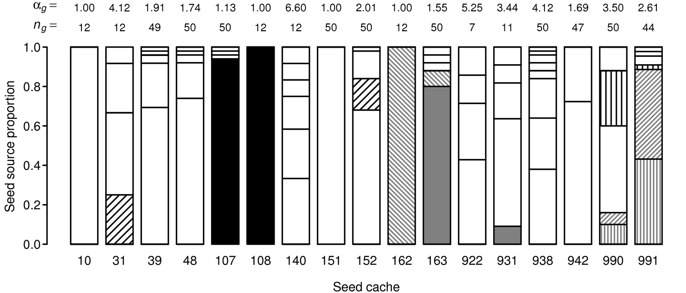
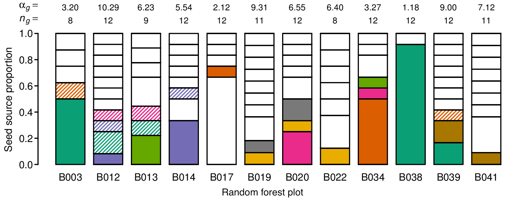
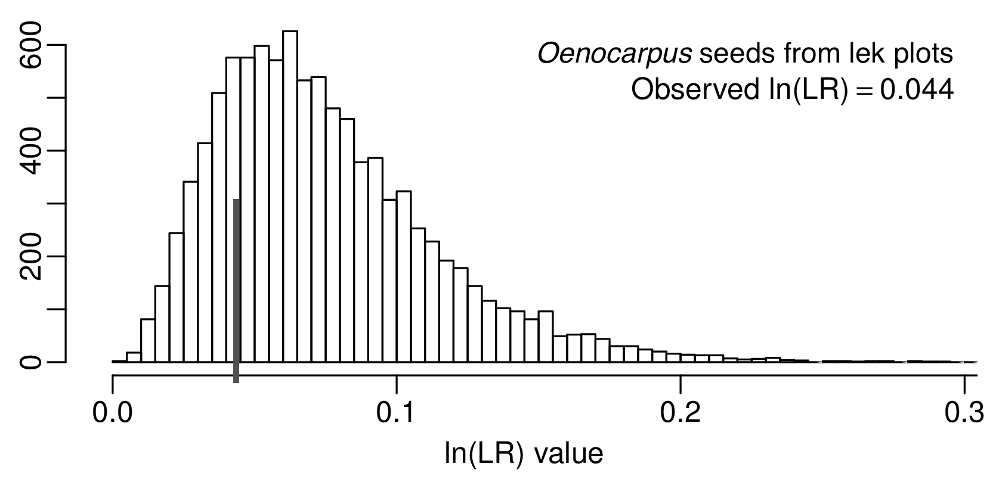
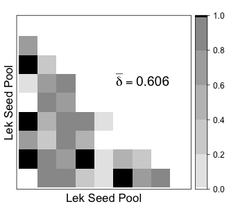

`dispersalDiversity`: Statistics and Tests
------------------------------------------

This is a collection of [R](http://www.r-project.org) functions to facilitate
analysis of dispersal in biological communities.  The bulk of the functions
calculate dispersal diversity statistics and allow for comparison of diversity
statistics, as described in Scofield _et al._ 2012 [_American Naturalist_ 180:
719-732](http://www.jstor.org/stable/10.1086/668202).  We originally developed
the diversity tests to understand seed dispersal in plant populations, but the
tests themselves should be useful for biodiversity data or any other
diversity-like data that can be expressed with this same data structure.

There are also new functions for calculating allelic diversity using these same
conceptual and statistical principles, and for comparing allele diversity
statistics.

**NOTE: This version has major changes to the interface.  For the version used in Scofield et al. (2012) with the previous interface, get the [release tagged 0.1](https://github.com/douglasgscofield/dispersalDiversity/releases), but simply `source` the files you are interested in... release 0.1 does not have an R package structure.**

* * *

These statistical tools were developed in collaboration with Peter Smouse ([Rutgers University](http://www.rci.rutgers.edu/~deenr/PES.html)) and  Victoria Sork ([UCLA](https://www.eeb.ucla.edu/Faculty/Sork/Sorklab/)) and were funded by U.S. National Science Foundation awards NSF-DEB-0514956 and NSF-DEB-0516529.

* * *

The **Mann-Whitney-Wilcoxon nested ranks test** we originally provided here has been made an R package:
```R
install.packages("nestedRanksTest")
vignette("nestedRanksTest")
```
and has been moved to [its own repository](https://github.com/douglasgscofield/nestedRanksTest).


Installation
------------

Install from github using `devtools`:

```R
install.packages("devtools")
devtools::install_github("douglasgscofield/dispersalDiversity")
library(dispersalDiversity)
```


Prerequisites
-------------

This package requires the `readGenalex` package v1.0 available from CRAN, which is
a prerequisite for this package and will be installed by default.

For producing plots, many find aesthetic colour choices to be available through
palettes in the `RColorBrewer` package.  `membershipPlot` (see below) will use
this package if it is available.  You may already have it installed, and the
metadata for `dispersalDiversity` lists it as a suggested package.  If it is
not installed, get it from CRAN:

```R
install.package("RColorBrewer")
```


Input requirements
------------------

Most functions take as input a simple data structure, an object of class
`divtable` which is a table of site (rows) by
source (columns) counts, which each cell representing the number of times that
source/species/type was observed at that site.

One method to create a random `divtable`:

```R
n.sites <- 5
n.sources <- 10
n.samples <- 120
## data frame of site-source pairs
t <- data.frame(site = sample(n.sites, n.samples, replace = TRUE),
                source = round(runif(n.samples) * n.sources + 0.5))

## site-by-source matrix
m1 <- do.call(rbind, lapply(split(t, t$site), function(x) table(x$source)))
# this creates a class c("matrix")
m1 <- as.divtable(m1)

## or use xtabs
m2 <- xtabs(data = t)
## this creates a class c("xtabs","table")
m2 <- as.divtable(m2)
```


Membership plots
----------------

One of the first things you may want to do is produce a membership plot.
Membership plots provide a visual representation of the site-by-source table.

**change these to plots from a random matrix**



If `fill.method = "colour"` and the library `RColorBrewer` is available, then
it is used to pick the colours used for filling groups.



Singleton sources (those that appear just once in just one site) are
distinguished using a white background, while multiton sources (those that
appear multiple times but still in just one site) can be distinguished with a
gray background using the option `distinguish.multiton = TRUE`.  Other options
are provided for controlling labelling of the plot and producing output to PDF
or PostScript files.

Both plots show that if the number of categories requiring colour/fill is
sufficiently large, hatching is combined with colours.  Both plots were
produced with `distinguish.multiton = FALSE`.

Further published examples of membership plots produced by this code or earlier
versions of this code can be seen Scofield _et al._ 2010, 2011, 2012.


Diversity statistics
--------------------

To calculate PMI statistics ([Grivet _et al._
2005](http://dx.doi.org/10.1111/j.1365-294X.2005.02680.x), [Scofield _et al._
2010](http://dx.doi.org/10.1111/j.1365-2745.2010.01649.x), [Scofield _et al._
2011](http://dx.doi.org/10.1007/s00442-010-1828-5)) and dispersal diversity
statistics([Scofield _et al._
2012](http://www.jstor.org/stable/10.1086/668202)) statistics
(<i>q<sub>gg</sub></i>, <i>&alpha;<sub>g</sub></i>, etc.), the function
`diversity()` has you covered.  It takes a site-by-source table and
calculates PMI and diversity statistics three different ways, each of
which treats possible bias differently and each of which is returned in
an otherwise identical sublist:

* `q` sublist, containing <i>q<sub>gg</sub></i>-based statistics, known to be 
  biased (Grivet _et al._ 2005)

* `q.nielsen`sublist, <i>q<sup>*</sup><sub>gg</sub></i>-based, which apply the
  transformation developed by Nielsen _et al._ (2003) to be unbiased and seem
  to perform well (Scofield _et al._ 2010, Scofield _et al._ 2011, Scofield _et
  al._ 2012).

* `r` sublist, <i>r<sub>gg</sub></i>-based, unbiased but poor performers at low
  sample sizes (Grivet _et al._ 2005, Scofield _et al._ 2012)


```R
source("diversityTests.R")
```

Additional source files are provided to perform other tasks.
`plotPairwiseMatrix.R` is available for plotting pairwise divergence/overlap
matrices.  More information is available below.  This file requires the
`pmiDiversity.R` source file to be available within the same directory:

```R
source("plotPairwiseMatrix.R")
```

`gammaAccum.R` is available for collecting &gamma; diversity accumulation
information and plotting this.  More information is avaialble below.  This file
requires the `pmiDiversity.R` source file to be available within the same
directory:

```R
source("gammaAccum.R")
```

### diversityTests.R

Defines several R functions which, like `pmiDiversity()`, take a site-by-source
table (one or more) and test diversity statistics within and among them.  See
(Scofield _et al._ 2012) for methodological details.  The file `pmiDiversity.R`
(see above) is required to be in the same directory, as it provides functions
used here.

Function | Description
-------- | -----------
`alphaDiversityTest(tab)` | Test for differences in &alpha; diversity among sites within a single dataset
`alphaContrastTest(tab.a, tab.b)` | Test whether there is a difference in the &alpha; diversity between two datasets
`alphaContrastTest.3(tab.a, tab.b, tab.c)` | Test whether there is a difference in the &alpha; diversity among three datasets
`plotAlphaTest(result)` | Plot the list returned from `alphaDiversityTest()` or `alphaContrastTest()` for evaluation
`pairwiseMeanTest(tab)` | Test whether mean pairwise divergence/overlap among sites is different from the null espectation
`plotPairwiseMeanTest()` | Plot the list returned from the above test for evaluation
`gammaContrastTest(tab.a, tab.b)` | Test whether there is a difference in the &gamma; diversity between two datasets
`gammaContrastTest.3(tab.a, tab.b, tab.c)` | Test whether there is a difference in the &gamma; diversity among three datasets

An example of the output of `plotAlphaTest()`:



and of `plotPairwiseMeanTest()`:


### plotPairwiseMatrix.R

Provides a function for plotting pairwise diversity matrices as returned by the
`pmiDiversity()` function, examples of which can be seen in Figure 4A-C of
Scofield _et al._ <I>Am Nat</I>.

`plotPairwiseMatrix()`
: Create a visual plot of pairwise divergence or overlap values as calculated by
`pmiDiversity()`

For example, with `tab` defined as above, plot the divergence matrix based on
_r<sub>gg</sub>_ calculations, labelling the axes "Seed Pool", using the
following code:


````R
pmiD <- pmiDiversity(tab)
plotPairwiseMatrix(pairwise.mat = pmiD$r$divergence.mat,
                   pairwise.mean = pmiD$r$divergence,
                   statistic = "divergence",
                   axis.label = "Seed Pool")
````




### gammaAccum.R

Provides functions for calculating &gamma; accumulation across sites, and
plotting the result, examples of which can be seen in Figure 4D-F of Scofield
_et al._ <I>Am Nat</I>.  The file `pmiDiversity.R` (see above) is required to be in
the same directory, as it provides functions used here.

A typical workflow using these functions would be:

````R
rga.result <- gammaAccum(tab)
plot(rga.result)
````

#### gammaAccum(tab)

Perform a &gamma; diversity accumulation on the site-by-source data in `tab`.
The result is returned in a list, which may be passed to `plot` to
plot the result.  Several arguments control the method of accumulation and
value of &gamma; calculated.  Only the defaults have been tested; the others were
developed while exploring the data and must be considered experimental.

`tab`
: Site-by-source table, same format as that passed to `pmiDiversity()`

`gamma.method`
: Calculate &gamma; using `"r"` (default), `"q.nielsen"` or `"q"`
method (see paper)

`resample.method`
: `"permute"` (default) or `"bootstrap"`; whether to resample
sites without (`"permute"`) or with (`"bootstrap"`) replacement

`accum.method`
: `"random"` (default) or `"proximity"`.  If `proximity` is
used, then `distance.file` must be supplied

`distance.file`
: A file or data.frame containing three columns of data, with
the header/column names being `pool`, `X`, and `Y`, containing the spatial
locations of the seed pools named in the row names of tab; only used with
`accum.method="proximity"`


#### plotGammaAccum(rga.result)

Create a visual plot of &gamma; accumulation results from `runGammaAccum()`.


#### Additional functions

The following functions typically won't be used separately, use `runGammaAccum()`
instead.

`gammaAccum()`
: Workhorse function for &gamma; accumulation

`gammaAccumStats()`
: Extracts stats from the result of `gammaAccum()`

`runGammaAccumSimple()`
: Wrapper that runs and then returns stats from `gammaAccum()`


Allelic Diversity
-----------------

These functions calculate allelic alpha, beta and gamma diversity as described by Sork et al. (unpublished), following the same conceptual and statistical principles described in Scofield et al. (2012).  These have been used to calculate the structure of allelic diversity for complete progeny genotypes as well as their decomposed male and female gametes, and to compare alpha and gamma diversity of progeny dispersed relatively short vs. long distances.

### Input requirements

Input begins as a file of genotypes in [GenAlEx](http://biology-assets.anu.edu.au/GenAlEx) format, which is read using the [`readGenalex`] R package (<https://github.com/douglasgscofield/readGenalex>) available via CRAN:

```R
install.packages("readGenalex")
```

### Usage

The augmented `data.frame` returned by `readGenalex()` is then processed into a list of tables, one per locus, using `allele.createTableList()`.  If the true ploidy of the input data does not the ploidy of the GenAlEx file, for example if haploid gametes are represented by a pair of homozygous alleles, then use the `new.ploidy=1` argument to `allele.createTableList()` to reduce the ploidy to its true level.

The list of tables is analysed as a unit by `allele.pmiDiversity()`, and can be passed to one of the contrast functions for testing against another list of tables.

### Workflow

The workflow to calculate basic allelic diversity statistics:

```R
library(readGenalex)
source("allelePmiDiversity.R")
dat <- readGenalex("GenAlEx-format-file-of-genotypes.txt")
gt <- allele.createTableList(dat)
div <- allele.pmiDiversity(gt)
```

For comparing allele diversity between two different samples:

```R
library(readGenalex)
source("allelePmiDiversity.R")
source("alleleDiversityTests.R")
dat1 <- readGenalex("file-of-genotypes-sample-1.txt")
dat2 <- readGenalex("file-of-genotypes-sample-2.txt")
gt1 <- allele.createTableList(dat1)
gt2 <- allele.createTableList(dat2)
alpha.contrast <- allele.alphaContrastTest(gt1, gt2)
gamma.contrast <- allele.gammaContrastTest(gt1, gt2)
```

For calculating and plotting gamma accumulation curves across all loci:

```R
library(readGenalex)
source("allelePmiDiversity.R")
source("alleleGammaAccum.R")
dat <- readGenalex("genotypes.txt")
lst <- allele.createTableList(dat)
allele.rga.result <- allele.runGammaAccum(lst)
plotGammaAccum(allele.rga.result)
```

#### Functions in `allelePmiDiversity.R`

`allele.pmiDiversity()`
: The function calculating diversity for a set of loci.  The single argument is a list produced by `allele.createTableList()`, and it uses the function `allele.pmiDiversitySingleLocus()`.

`allele.createTableList()`
: Take a data.frame of genotypes read by readGenalex(), produce a list of allele count tables used by the other functions.  Each entry of the list is, for each locus, a table of site x allele counts, with row names being the site names, and column names being the names given to the individual alleles.

`allele.pmiDiversitySingleLocus()`
: The single argument is, for a single locus, a table of site &times; allele counts, with row names being the site names, and column names being the names given to the individual alleles.

#### Functions in `alleleDiversityTests.R`

`allele.alphaDiversityTest(lst)`
: Test whether there is a difference in the alpha diversity among patches in an allele diversity dataset, that is, whether &beta; = 1 or &delta; = 0 across a collection of patches at a site (see Sork et al.).

`allele.alphaContrastTest(lst.a, lst.b)`
: Test whether there is a difference in the alpha diversity between two lists of allele diversity datasets.

`allele.gammaContrastTest(lst.a, lst.b)`
: Test whether there is a difference in the gamma diversity between two allele diversity datasets.

#### Functions in `alleleGammaAccum.R`

`allele.runGammaAccum(lst)`
: Perform a gamma diversity accumulation on the site-by-source data in tab.  Several arguments control the method of accumulation and value of gamma calculated.  Other arguments are identical to `gammaAccum()`.  Only the defaults have been tested; the others were developed while exploring the data and must be considered experimental.  The result is returned in a list, which may be passed to `plotGammaAccum()` to plot the result.

* * *

We also provide the datasets `granaries_2002_Qlob` and `granaries_2004_Qlob`,
which include assignments of *Quercus lobata* acorns harvested from acorn
woodpecker granaries in 2002 and 2004 to seed source trees.

* * *

# References

Grivet D, Smouse PE, Sork VL. 2005. A novel approach to an old
problem: tracking dispersed seeds. [_Molecular Ecology_ 14: 3585-3595](http://dx.doi.org/10.1111/j.1365-294X.2005.02680.x).

Nielsen R, Tarpy DR, Reeve HK. 2003. Estimating effective paternity
number in social insects and the effective number of alleles in a population.
[_Molecular Ecology_ 12: 3157-3164](http://dx.doi.org/10.1046/j.1365-294X.2003.01994.x).

Scofield DG, Smouse PE, Karubian J, Sork VL.  2012.  Use of
alpha, beta, and gamma diversity measures to characterize seed dispersal by animals.
[_American Naturalist_ 180: 719-732](http://www.jstor.org/stable/10.1086/668202),
[supplement](http://www.jstor.org/stable/full/10.1086/668202#apa), [data](http://dx.doi.org/10.5061/dryad.40kq7).

Scofield DG, Alfaro VR, Sork VL, Grivet D, Martinez E, Papp J, Pluess AR, Koenig WD, Smouse PE.  2011.  Foraging patterns of acorn woodpeckers (<i>Melanerpes
formicivorus</i>) on valley oak (<i>Quercus lobata</i> N&eacute;e) in two California oak
savanna-woodlands. [_Oecologia_ 166: 187-196](http://dx.doi.org/10.1007/s00442-010-1828-5),
[supplement](http://link.springer.com/content/esm/art:10.1007/s00442-010-1828-5/MediaObjects/442_2010_1828_MOESM1_ESM.doc).

Scofield DG, Sork VL, Smouse PE. 2010. Influence of acorn
woodpecker social behaviour on transport of coast live oak (<i>Quercus agrifolia</i>)
acorns in a southern California oak savanna. [_Journal of Ecology_ 98: 561-572](http://dx.doi.org/10.1111/j.1365-2745.2010.01649.x),
[supplement](http://onlinelibrary.wiley.com/doi/10.1111/j.1365-2745.2010.01649.x/suppinfo).

